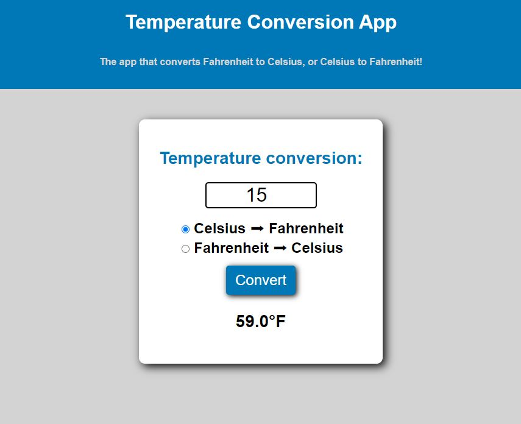

# Temperature Conversion App

## Project Description

Introducing an intuitive Temperature Conversion App designed to effortlessly convert between Fahrenheit and Celsius. With a user-friendly interface, simply input a numeric value, and watch as the app dynamically renders the corresponding unit of measurement in real-time. Whether it's converting from Fahrenheit to Celsius or vice versa, this app provides seamless temperature conversions at your fingertips.

## Deployment Screenshot

[Deployment Link](https://travisfowlston.github.io/temp-converter/)

## Credits

- Project was completed by Travis Fowlston.

## License

- Please refer to the LICENSE in the repository.
